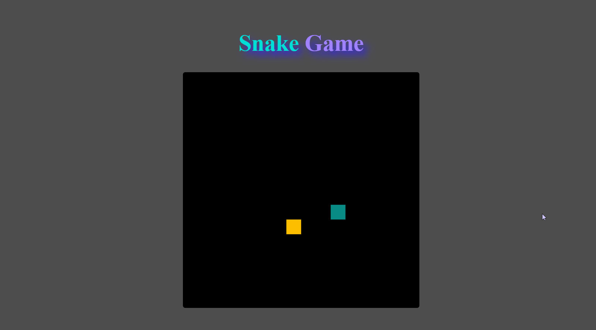

<h1 align="center"> SNAKE GAME </h1>

<nav align="center">
          <a href="#Technologies">Tecnologias </a>|
          <a href="#Project">Projeto </a>|
          <a href="#knowledge">Conhecimentos </a>|
          <a href="#license">Licença</a>
        </nav>

 
 

 
 

<h2 id="Technologies"> Tecnologias </h2>

Esse projeto foi desenvolvido com as seguintes tecnologias:

- HTML
- CSS
- JavaScript

 

<h2 id="Project"> Projeto </h2>

Nesse projeto foi desenvolvido o jogo da cobrinha na plataforma da <a href="digitalinnovation.one/">Digital Innovation One</a> no Bootcamp HTML Web Developer.

 

<h2 id="knowledge"> Conhecimentos </h2>

O foco do projeto foi colocar em prática conceitos básicos da linguagem de programação JavaScript onde usamos condicionais, laços de repetição, funções, eventos, introdução de objetos e orientação a objetos.

 

<h2 id="license"> Licença </h2>
Esse projeto está sob a licença <a href="https://choosealicense.com/licenses/mit//">MIT</a>. Veja o arquivo LICENSE para mais detalhes.

Feito com ♥ by Leonardo Dantas 👋
